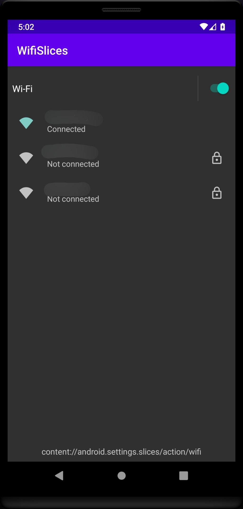

# WifiSlices
An app that uses Wi-Fi Slices from the Android Settings app. This is only meant for custom Android
builds, as this app needs special permissions to display the Slice.



It's possible to show the other Slices offered by the Settings app. The other available options are
stored in SettingSliceProvider:

```java
/**
 * A list of custom slice uris that are supported publicly. This is a subset of slices defined
 * in {@link CustomSliceRegistry}. Things here are exposed publicly so all clients with proper
 * permission can use them.
 */
private static final List<Uri> PUBLICLY_SUPPORTED_CUSTOM_SLICE_URIS =
        Arrays.asList(
                CustomSliceRegistry.BLUETOOTH_URI,
                CustomSliceRegistry.FLASHLIGHT_SLICE_URI,
                CustomSliceRegistry.LOCATION_SLICE_URI,
                CustomSliceRegistry.MOBILE_DATA_SLICE_URI,
                CustomSliceRegistry.WIFI_CALLING_URI,
                CustomSliceRegistry.WIFI_SLICE_URI,
                CustomSliceRegistry.ZEN_MODE_SLICE_URI
        );
```

## How to use
You need to run a build of AOSP or some fork of it that uses a Settings app that whitelists this
example app for its Slices. See [whitelist-wifislices-app.patch](whitelist-wifislices-app.patch).
To apply this patch, run from the AOSP root:

    $ cd packages/app/Settings
    $ git apply < /path/to/whitelist-wifislices-app.patch

Build the Settings app and install it onto the device. Then, install/open this app.

The Settings app whitelisting this WifiSlices example app is the only way to display the Slice
properly, because the SettingsSliceProvider just has a no-op PendingIntent when Slice permissions
are requested.

## Caveats
* Only usable for things like setup wizards where the setup wizard app can be whitelisted in the
  Settings app resources for a particular OS build.
* The number of access points shown is only at most 3; however, this can be changed by adjusting
  com.android.settings.wifi.slice.WifiSlice#DEFAULT_EXPANDED_ROW_COUNT.
* Other options such as adding a network by manual input or by QR code are not exposed in the Slice.
  You have to tap the Slice's "Wi-Fi" header in order to enter the full Wi-Fi settings Fragment.
  It's not immediately obvious that you can do this.
